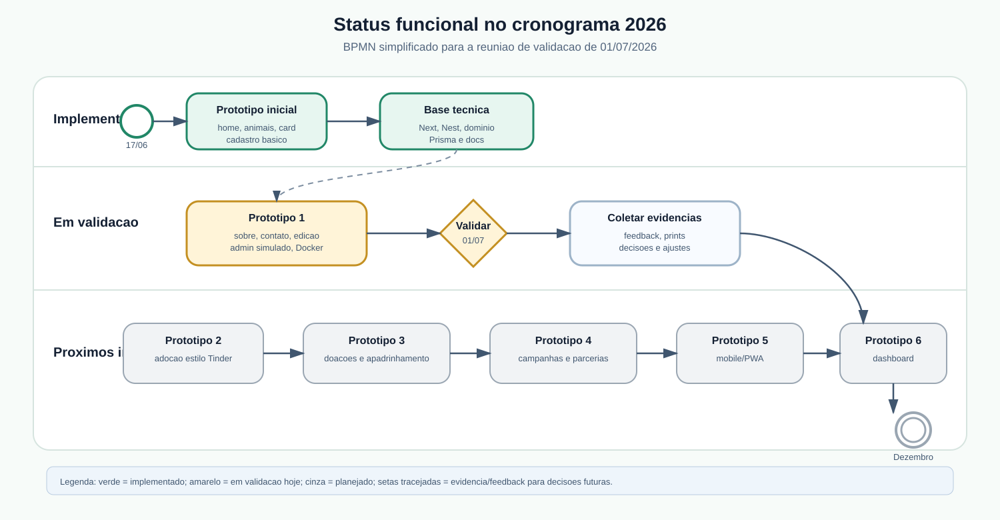
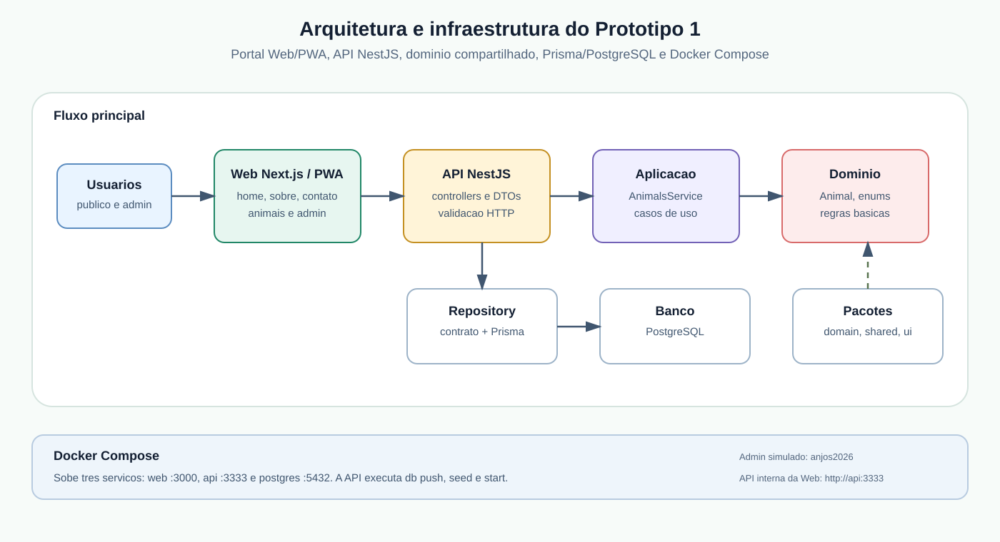
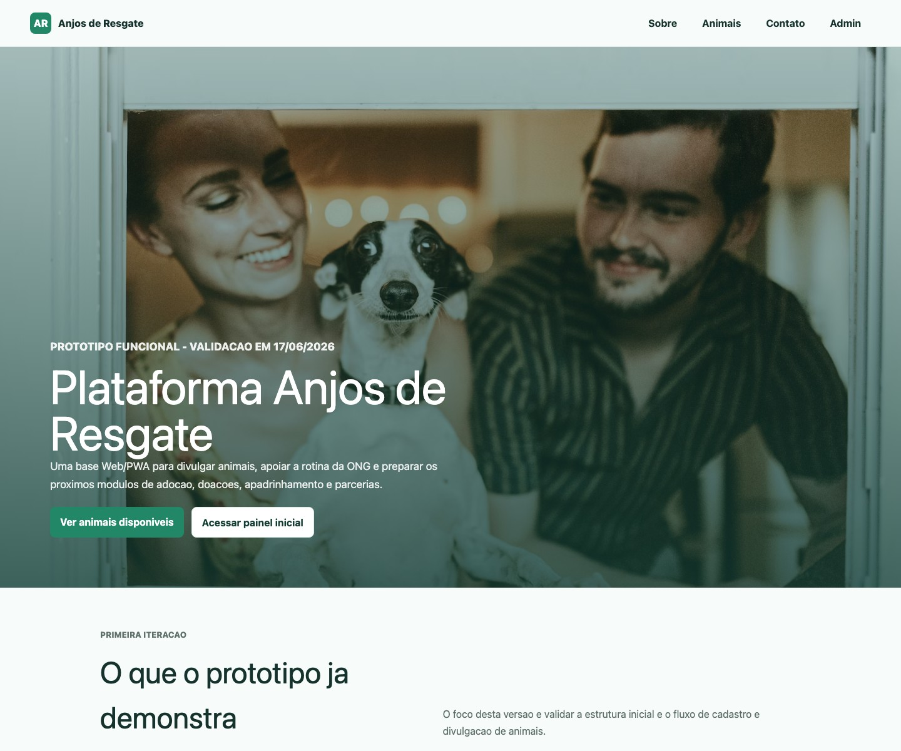
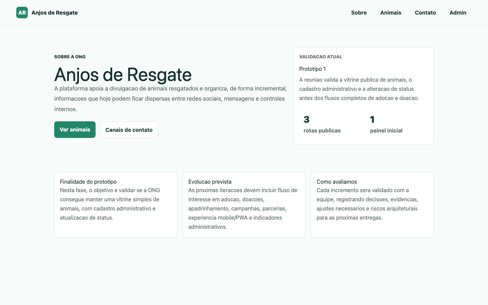
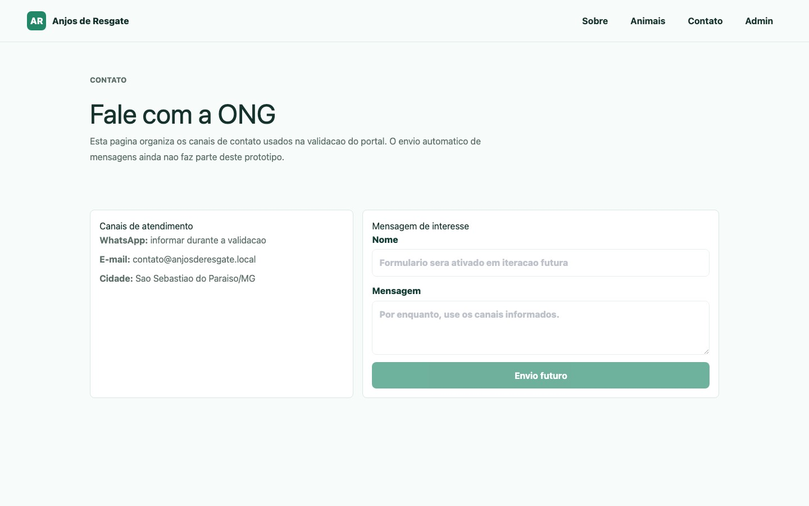
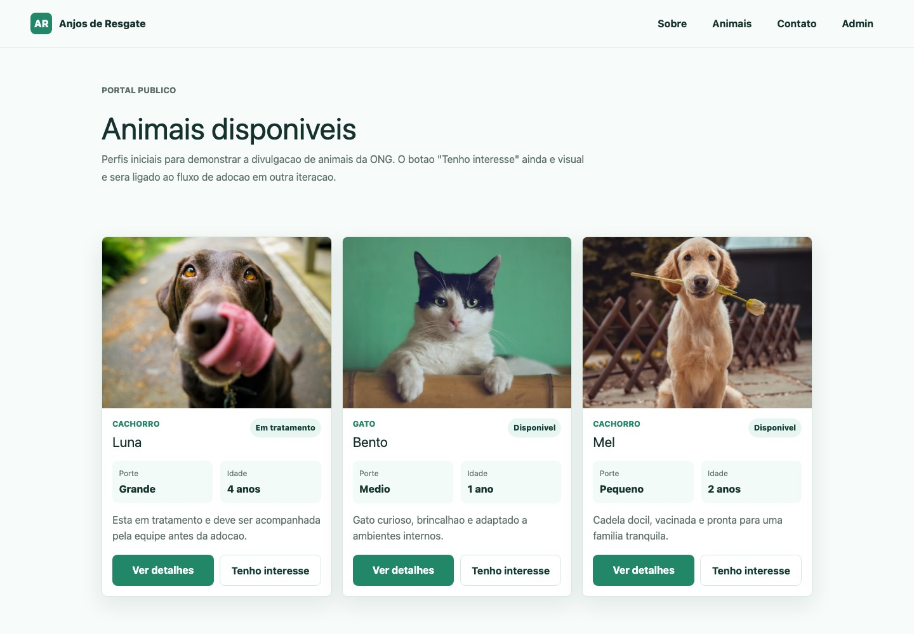
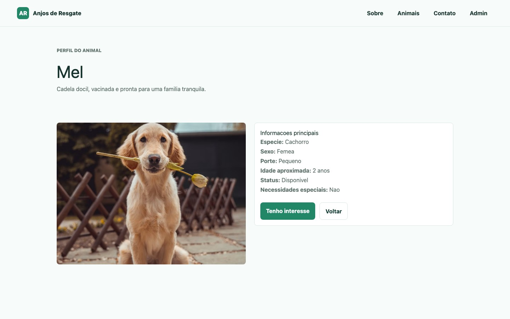
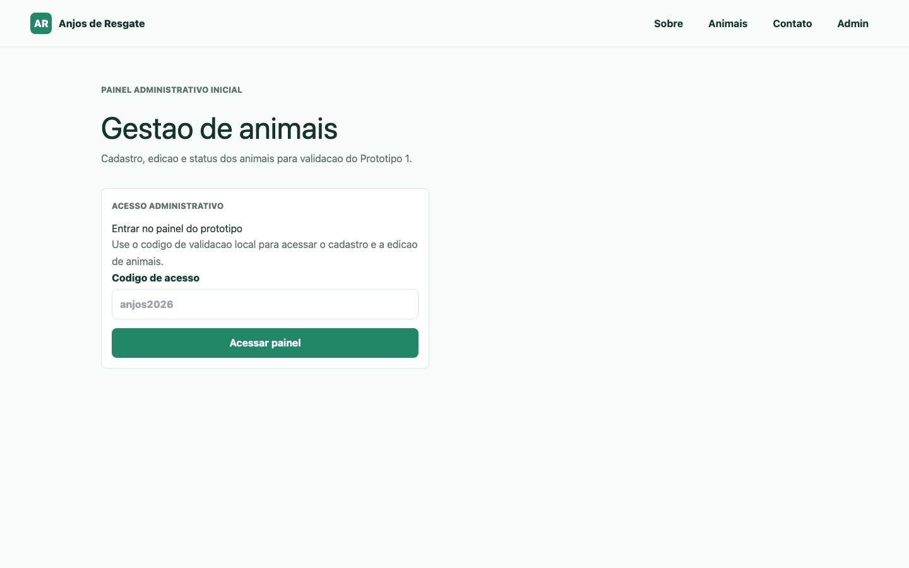
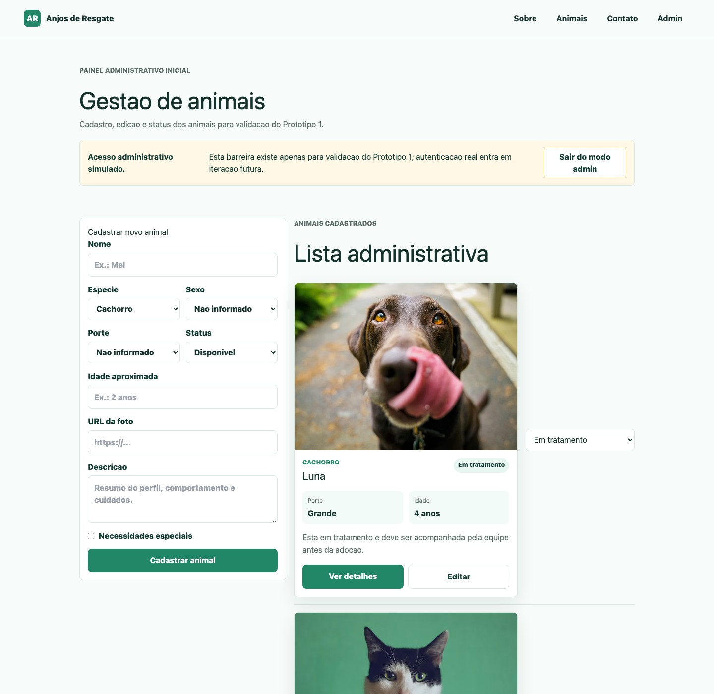

# Prototipo atual - Guia visual para validacao

Documento resumido para reunioes de validacao de funcionalidades, seguindo o
cronograma incremental da Plataforma Anjos de Resgate.

## Objetivo da validacao

Validar se o portal, o feed, os interesses de adocao, o contato e as formas de
apoio atendem ao fluxo incremental da ONG.

## Acessos rapidos

Com o Docker Compose em execucao:

```bash
sh scripts/docker-prototype.sh up
```

| Tela              | Link local                                     | Finalidade                                 |
| ----------------- | ---------------------------------------------- | ------------------------------------------ |
| Inicio            | http://localhost:3000                          | Apresentar a plataforma e destacar animais |
| Sobre             | http://localhost:3000/sobre                    | Explicar finalidade da ONG e do prototipo  |
| Contato           | http://localhost:3000/contato                  | Mostrar canais iniciais de contato         |
| Animais           | http://localhost:3000/animais                  | Mostrar feed compacto de animais           |
| Detalhe do animal | http://localhost:3000/animais/demo-mel         | Exibir perfil individual                   |
| Admin             | http://localhost:3000/admin/animais            | Ver inventario, interesses e status        |
| Cadastro          | http://localhost:3000/admin/animais/cadastro   | Cadastrar novo animal                      |
| Solicitacoes      | http://localhost:3000/admin/animais/interesses | Revisar interesses por animal              |
| Apoie             | http://localhost:3000/apoie                    | Registrar doacao ou apoio                  |
| Admin de apoios   | http://localhost:3000/admin/apoios             | Gerir campanhas, necessidades e historico  |
| E-mails locais    | http://localhost:8025                           | Conferir mensagens enviadas                |

Codigo administrativo simulado:

```text
anjos2026
```

Galeria estruturada de prints: [docs/18-prints-telas-prototipo-1.md](18-prints-telas-prototipo-1.md).

## Visao do que ja foi implementado



Resumo:

- Implementado no prototipo inicial: tela inicial, listagem publica, detalhe de
  animal, card reutilizavel, cadastro basico, API de animais e documentacao.
- Implementado no Prototipo 1: pagina sobre, pagina de contato, login
  administrativo simulado, edicao de animais e execucao com Docker.
- Implementado no Prototipo 2.1: feed compacto para dezenas de animais,
  registro publico de interesse em adocao, telas administrativas separadas e
  quantidade de interesses por animal no inventario e nas solicitacoes.
- Implementado no Prototipo 3: upload de foto, contato por e-mail, doacao geral,
  campanhas, apadrinhamento, necessidades por animal, doadores e historico.
- Proximos passos: validar privacidade, autenticacao, textos e Pix reais antes
  de decidir qualquer integracao financeira.

## Arquitetura e infraestrutura



Como esta organizado:

- Interface: paginas Next.js e componentes React.
- Aplicacao: API NestJS com `AnimalsService`.
- Dominio: entidade `Animal`, enums e validacoes independentes de framework.
- Infraestrutura: Prisma, PostgreSQL, repositorio em memoria para prototipo e
  Docker Compose.
- Evidencias: documentacao, ADRs, diagramas e registros ArcAssist-Web.
- Interesse em adocao: entidade de dominio, API, persistencia e visualizacao
  administrativa sem concluir adocao automaticamente.
- Feed de muitos animais: tiles quadrados no publico, inventario compacto no
  admin e seed ampliado para validar volume.
- Contagem de interesses: aparece no resumo administrativo de cada animal e na
  tela de solicitacoes.

## Funcionalidades para demonstrar

### 1. Portal inicial

Link: http://localhost:3000

O que validar:

- A proposta da plataforma esta clara?
- Os botoes principais levam para a listagem e para o admin?
- Os animais em destaque ajudam a comunicar o objetivo?



### 2. Pagina sobre a ONG

Link: http://localhost:3000/sobre

O que validar:

- O texto explica bem a finalidade da plataforma?
- A evolucao planejada esta compreensivel?
- Falta alguma informacao institucional importante?



### 3. Pagina de contato

Link: http://localhost:3000/contato

O que validar:

- Os canais de contato estao adequados?
- O formulario desabilitado deixa claro que envio automatico e futuro?
- Quais dados reais devem aparecer nessa pagina?



### 4. Feed publico de animais

Link: http://localhost:3000/animais

O que validar:

- Os tiles exibem as informacoes essenciais?
- Status, idade, porte e especie estao claros?
- O feed permite observar muitos animais sem cansar a leitura?
- O formato quadrado e adequado para uma futura experiencia com midia/video?



### 5. Detalhe do animal

Link: http://localhost:3000/animais/demo-mel

O que validar:

- O perfil individual tem informacoes suficientes?
- O formulario `Tenho interesse` esta claro?
- Os campos nome, contato e mensagem sao suficientes para iniciar retorno?
- A mensagem deixa claro que a adocao ainda depende de avaliacao da equipe?



### 6. Acesso administrativo simulado

Link: http://localhost:3000/admin/animais

O que validar:

- O acesso simulado e suficiente para a validacao de hoje?
- A mensagem deixa claro que ainda nao e autenticacao real?
- A equipe entende que usuarios e permissoes entram depois?



### 7. Painel administrativo de animais

Link: http://localhost:3000/admin/animais

O que validar:

- O cadastro tem os campos minimos corretos?
- A edicao de animais esta intuitiva?
- A alteracao de status cobre a rotina atual da ONG?
- Falta upload de imagem, filtros ou outros campos?



## O que foi implementado tecnicamente

| Area        | Implementado                                                         | Arquivos principais                                                                                                                        |
| ----------- | -------------------------------------------------------------------- | ------------------------------------------------------------------------------------------------------------------------------------------ |
| Web/PWA     | Paginas inicio, sobre, contato, feed de animais, detalhe e admin     | `apps/web/src/app`                                                                                                                         |
| Componentes | Card de animal, formulario, status updater e acesso admin            | `apps/web/src/components`, `packages/ui`                                                                                                   |
| Conteudo    | Textos, links e imagem principal centralizados para edicao por PR    | `packages/shared/src/site-content.ts`                                                                                                      |
| API         | CRUD inicial de animais e health check                               | `apps/api/src/animals`, `apps/api/src/health.controller.ts`                                                                                |
| Interesses  | Registro publico, solicitacoes administrativas e contagem por animal | `apps/api/src/adoption-interests`, `apps/web/src/components/AdoptionInterestForm.tsx`, `apps/web/src/components/AdoptionInterestsList.tsx` |
| Dominio     | Entidades `Animal` e `AdoptionInterest`, enums e validacoes basicas  | `packages/domain/src`                                                                                                                      |
| Dados       | Prisma/PostgreSQL, SQLite opcional e seed com dezenas de animais     | `apps/api/prisma`, `packages/shared/src/demo-animals.ts`                                                                                   |
| Docker      | Web, API e Postgres em Compose                                       | `docker-compose.yml`, `apps/*/Dockerfile`                                                                                                  |
| Evidencias  | Registro ArcAssist-Web do incremento                                 | `docs/15-prototipo-1-arcassist-web`                                                                                                        |
| Apoios      | Campanhas, necessidades, doadores e historico                        | `packages/domain/src/support.ts`, `apps/api/src/support`, `apps/web/src/app/apoie`, `apps/web/src/app/admin/apoios`                         |
| Upload      | Selecao e persistencia de imagem                                     | `apps/api/src/uploads`, `apps/web/src/components/AnimalForm.tsx`                                                                            |
| Contato     | Envio SMTP e caixa local                                             | `apps/api/src/contact`, `apps/web/src/components/ContactForm.tsx`, `mailpit`                                                                 |

## O que ainda falta

Ainda nao foi implementado:

- autenticacao real;
- permissoes por perfil;
- auditoria administrativa;
- upload de imagem;
- upload e gestao real de videos;
- filtros avancados de animais;
- paginacao para grandes volumes;
- fluxo completo de adocao;
- experiencia estilo Tinder;
- cadastro completo de adotantes;
- triagem de adotantes;
- painel administrativo para editar textos e imagens do portal;
- processamento automatico de pagamento;
- autenticacao, permissoes e privacidade formal para doadores;
- parcerias;
- dashboard e relatorios.

## Roteiro sugerido para a reuniao

1. Abrir a tela inicial e explicar o objetivo do Prototipo 1.
2. Passar por Sobre e Contato para validar o portal institucional.
3. Abrir o feed compacto e o detalhe de um animal.
4. Entrar no admin com `anjos2026`.
5. Abrir a tela de solicitacoes e conferir interesses por animal.
6. Cadastrar um animal na tela propria.
7. Editar um animal pelo inventario.
8. Alterar o status de um animal.
9. Registrar feedbacks em `docs/06-validacoes.md`.
10. Decidir prioridades para o Prototipo 2.

## Evidencias ja registradas

- Build Docker das imagens `api` e `web`.
- Execucao com PostgreSQL, API e Web.
- API validada via `/health`.
- Seed inicial agora preparado com dezenas de animais ficticios.
- Web validada com resposta HTTP 200 dentro do container.
- Registro em `docs/15-prototipo-1-arcassist-web/run-log.md`.
